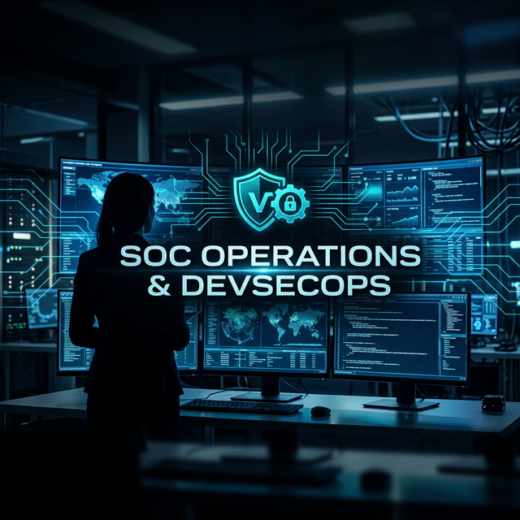

  

  # 🤖 Francisco Amaro
  ### Senior Full Stack Developer | SOC Analyst L1 | DevSecOps Engineer
  
  
  
  
  

---

## 🕵️‍♂️ SOC Command Center: Recent Labs & "Proof of Work"

He transformado mi experiencia como desarrollador Full Stack en una fortaleza defensiva. Aquí tienes la "Trinidad" de mis laboratorios de seguridad proactiva:

| Proyecto | Core Focus | Tecnologías Secundarias |
|:--- |:--- |:--- |
| **[VeriFactu-SOC-Demo](https://github.com/franamaro-dev/VeriFactu-SOC-Demo)** | **Integridad de Datos** & Hashing Chain | Python, SQLite, Hashlib |
| **[SOC-L1-Level-Demo](https://github.com/franamaro-dev/SOC-L1-Level-Demo)** | **Honeypots** & Syslog Detection | http.server, Regex Signatures |
| **[Secure-MediScribe](https://github.com/franamaro-dev/mediscribe-ai-backend)** | **DevSecOps** & API Hardening | FastAPI, Pydantic, Security Headers |

---

## 🛠️ Stack Tecnológico de Vanguardia

### 🧱 Defensa & Infraestructura (Defensive Ops)
- **SIEM/Detection**: Análisis de payloads, detección de inyecciones (SQLi, XSS, RCE).
- **Hardening**: Gestión de cabeceras HTTP, CORS restrictivo, protección contra Clickjacking.
- **Infras-as-Code**: Despliegues seguros con **Docker** y **Terraform** (Zero-Trust Mindset).

### 🤖 Automatización & DevSecOps
- **SOAR Concept**: Orquestación de alertas con **n8n** (triaje automático y escalado).
- **Secure Code**: Validación estricta de esquemas, sanitización de inputs y gestión de secretos.

---

## 📊 Métricas de Ingeniería & Actividad

  
   
  

---

## 📫 Let's Neutralize Threats Together
- 💼 Buscando impactar en equipos de **SOC Analyst / DevSecOps Engineer**.
- 📍 Jaén, España (Global Ready).
- 💬 Hablemos sobre: **Ciberseguridad Proactiva**, **Inteligencia de Amenazas** y **Automatización Defensiva**.

  "La seguridad no es un producto, es un proceso incesante."

